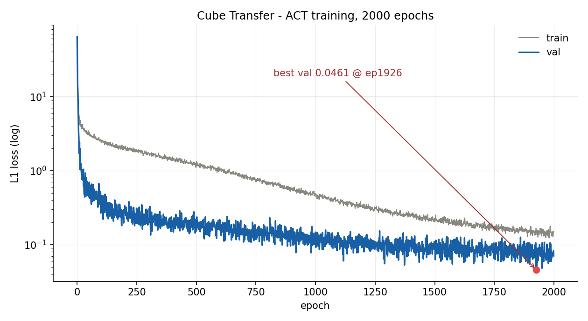
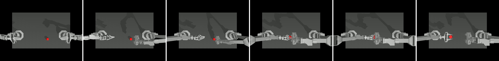
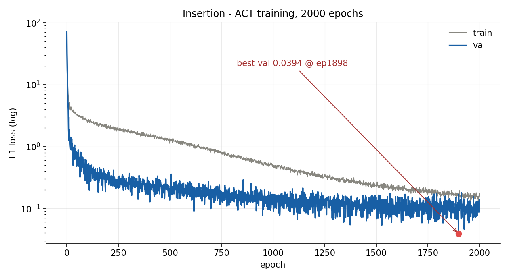
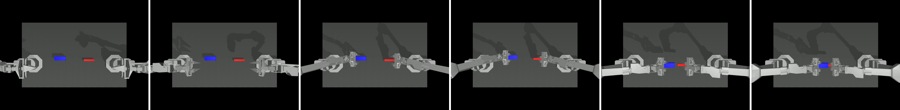
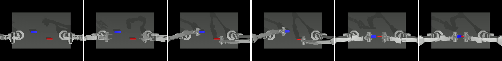

# ACT / ALOHA 仿真复现

复现 [*Learning Fine-Grained Bimanual Manipulation with Low-Cost Hardware*](https://arxiv.org/abs/2304.13705)在 MuJoCo 上的两个双臂任务。训练与评估均在单卡 RTX 4090 D 上完成，论文配置 2000 epochs。

| 任务 | 结果 | 论文 | 视频 |
|---|---|---|---|
| `sim_transfer_cube_scripted` 双臂传递方块 | **49/50 = 98.0%** | 86% | [普通做法](sim_transfer_cube_scripted/final_ep2000/rollout00_no_temporal_agg_success_return685.mp4) ｜ [TE](sim_transfer_cube_scripted/final_ep2000/rollout00_temporal_agg_success_return640.mp4) |
| `sim_insertion_scripted` 双臂插入 | **15/50 = 30.0%** | 32% | [成功](sim_insertion_scripted/eval_ep2000/rollout12_success_return460.mp4) ｜ [失败](sim_insertion_scripted/eval_ep2000/rollout00_fail_return430.mp4) |

论文数字为 3 个 seed 平均，本仓库只跑了 1 个 seed（seed 0）的 50 次评估。

---

## 双臂传递方块 · 98.0%

训练损失（灰 train ／ 蓝 val，最低 0.0461 @ 第 1926 轮）：

第 0 条 rollout 的关键帧：

## 双臂插入 · 30.0%

训练损失（最低 0.0394 @ 第 1898 轮）：

第 12 条 rollout（成功）：

第 0 条 rollout（失败 —— 插片已对准插槽，但没顶到底）：

插入任务要求插片推进到槽底才算成功，所以失败录像看上去很像成功。

---

视频为评估时录制的完整 rollout（每条 8 秒、400 步）。代码、完整日志与逐条数据不在本仓库。
